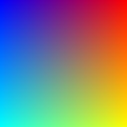

<!-- README.md is generated from README.Rmd. Please edit that file -->

```{r setup, include = FALSE}
suppressPackageStartupMessages({
  library(dplyr)
  library(ggplot2)
  
  library(mininetpbm)
})

knitr::opts_chunk$set(
  collapse = TRUE,
  comment = "#>",
  fig.path = "man/figures/README-",
  out.width = "100%"
)
```


# mininetpbm

`mininetpbm` is a package for writing vectors, matrices and arrays as NETPBM
image files i.e. PGM and PPM formats.


## Installation

You can install the released version of mininetpbm from [github](https://github.com/coolbutuseless/mininetpbm) with:

``` r
remotes::install_github('coolbutuseless/mininetpbm')
```

## Outputting a 1D vector as a PGM file


```{r example}
#~~~~~~~~~~~~~~~~~~~~~~~~~~~~~~~~~~~~~~~~~~~~~~~~~~~~~~~~~~~~~~~~~~~~~~~~~~~~~
# Create an integer matrix and integer vector
#~~~~~~~~~~~~~~~~~~~~~~~~~~~~~~~~~~~~~~~~~~~~~~~~~~~~~~~~~~~~~~~~~~~~~~~~~~~~~
N       <- 255
int_vec <- rep.int(seq(N), N) %% 256
int_mat <- matrix(int_vec, N, N, byrow = TRUE)
dbl_mat <- int_mat/255


#~~~~~~~~~~~~~~~~~~~~~~~~~~~~~~~~~~~~~~~~~~~~~~~~~~~~~~~~~~~~~~~~~~~~~~~~~~~~~
# Create a colourful integer array (RGB)
#~~~~~~~~~~~~~~~~~~~~~~~~~~~~~~~~~~~~~~~~~~~~~~~~~~~~~~~~~~~~~~~~~~~~~~~~~~~~~
r <- int_mat
g <- t(int_mat)
b <- int_mat[, rev(seq(ncol(int_mat)))]

int_arr <- array(c(r, g, b), dim = c(N, N, 3))
  
  
#~~~~~~~~~~~~~~~~~~~~~~~~~~~~~~~~~~~~~~~~~~~~~~~~~~~~~~~~~~~~~~~~~~~~~~~~~~~~~
# write the vector as a PGM image file
#~~~~~~~~~~~~~~~~~~~~~~~~~~~~~~~~~~~~~~~~~~~~~~~~~~~~~~~~~~~~~~~~~~~~~~~~~~~~~
write_pnm(int_mat, "man/figures/mini.pgm")
```

```{r echo = FALSE}
system("convert man/figures/mini.pgm man/figures/mini.png")
```


## Outputting a 3D array as a PPM file

```{r}
write_pnm(int_arr, "man/figures/mini3.ppm")
```

```{r echo = FALSE}
system("convert man/figures/mini3.ppm man/figures/mini3.png")
```




# Benchmark

```{r fig.width = 8, warning=FALSE}
res <- bench::mark(
  write_pnm(int_arr, filename = "colour_cbu.ppm"),
  png::writePNG(int_arr, target = 'colour_png.png'),
  jpeg::writeJPEG(int_arr, target = 'colour_jpeg.jpg'),
  pixmap::write.pnm(pixmap::pixmapRGB(int_arr), file = 'colour_pixmap.ppm'),
  rtiff::writeTiff(pixmap::pixmapRGB(int_arr), fn = 'colour_rtiff.tiff'),
  imager::save.image(imager::as.cimg(int_arr), file = "colour_cimg.png"),
  imager::save.image(imager::as.cimg(int_arr), file = "colour_cimg.jpg"),
  check = FALSE
)
```

```{r echo = FALSE}
summary(res) %>%
  select(expression, mean, median, `itr/sec`, mem_alloc) %>%
  knitr::kable(caption = "Benchmark results")

plot(res) + 
  theme_bw(10) + 
  theme(
    legend.position = 'bottom'
  )
```


