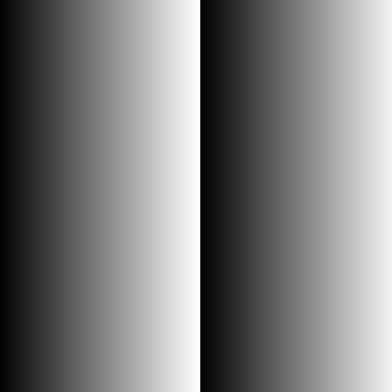
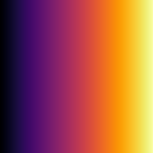

<!-- README.md is generated from README.Rmd. Please edit that file -->

# mininetpbm

`mininetpbm` is a package for writing vectors, matrices and arrays as
NETPBM image files i.e. PGM and PPM formats.

The design goals:

1.  Fast
2.  Pure R
3.  Zero dependencies
4.  Write only

What’s in the
box:

| Input        | PGM (fast, no checks)     | PPM (fast, no checks)    | PGM/PPM (Proper checks)   |
| ------------ | ------------------------- | ------------------------ | ------------------------- |
| Vector       | `write_pgm()`             | `write_ppm()`            | `write_pnm()`             |
| Matrix/Array | `write_pgm_from_matrix()` | `write_ppm_from_array()` | `write_pnm_from_matrix()` |
|              |                           |                          | `write_pnm_from_array()`  |

The **fast**/**unsafe** functions assume that the caller has done all
the necessary sanity checks for type, range, size and NAs, and does no
checks for correctness. These *unsafe* functions offer up to \~50% speed
increase over the **safe** image writing functions.

## Installation

You can install the released version of mininetpbm from
[github](https://github.com/coolbutuseless/mininetpbm)
with:

``` r
remotes::install_github('coolbutuseless/mininetpbm')
```

## Outputting a 1D vector as a PGM file

``` r
#~~~~~~~~~~~~~~~~~~~~~~~~~~~~~~~~~~~~~~~~~~~~~~~~~~~~~~~~~~~~~~~~~~~~~~~~~~~~~
# Create a integer vector with length NxN, and a matrix version as well
#~~~~~~~~~~~~~~~~~~~~~~~~~~~~~~~~~~~~~~~~~~~~~~~~~~~~~~~~~~~~~~~~~~~~~~~~~~~~~
N       <- 255
int_vec <- rep.int(seq(N), N) %% 256
int_mat <- matrix(int_vec, N, N, byrow = TRUE)

#~~~~~~~~~~~~~~~~~~~~~~~~~~~~~~~~~~~~~~~~~~~~~~~~~~~~~~~~~~~~~~~~~~~~~~~~~~~~~
# write the vector as a PGM image file
#~~~~~~~~~~~~~~~~~~~~~~~~~~~~~~~~~~~~~~~~~~~~~~~~~~~~~~~~~~~~~~~~~~~~~~~~~~~~~
write_pgm(int_vec, N, N, "man/figures/mini.pgm")
```


## Outputting a 2D matrix as a PGM file

``` r
#~~~~~~~~~~~~~~~~~~~~~~~~~~~~~~~~~~~~~~~~~~~~~~~~~~~~~~~~~~~~~~~~~~~~~~~~~~~~~
# write the matrix as a PGM image file
#~~~~~~~~~~~~~~~~~~~~~~~~~~~~~~~~~~~~~~~~~~~~~~~~~~~~~~~~~~~~~~~~~~~~~~~~~~~~~
write_pgm_from_matrix(int_mat, "man/figures/mini2.pgm")
```



## Outputting a 3D array as a PPM file

``` r
#~~~~~~~~~~~~~~~~~~~~~~~~~~~~~~~~~~~~~~~~~~~~~~~~~~~~~~~~~~~~~~~~~~~~~~~~~~~~~
# Create integer matrices for R, G, B planes
# Stack into a 3D array
#~~~~~~~~~~~~~~~~~~~~~~~~~~~~~~~~~~~~~~~~~~~~~~~~~~~~~~~~~~~~~~~~~~~~~~~~~~~~~
N       <- 255
int_vec <- rep.int(seq(N), N) %% 256
int_mat <- matrix(int_vec, nrow = N, ncol = N, byrow = TRUE)

r <- int_mat
g <- t(int_mat)
b <- int_mat[, rev(seq(ncol(int_mat)))]

int_arr <- array(c(r, g, b), dim = c(N, N, 3))
write_ppm_from_array(int_arr, "man/figures/mini3.ppm")
```


# Bonus - write a greyscale vector mapped to a `viridis` colour map

``` r
write_ppm_with_viridis(int_vec, N, N, "man/figures/mini4.ppm", pal = 'inferno')
```


