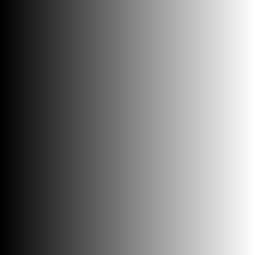

<!-- README.md is generated from README.Rmd. Please edit that file -->

# mininetpbm

`mininetpbm` is a package for writing vectors, matrices and arrays as
NETPBM image files i.e. PGM and PPM formats.

## Installation

You can install the released version of mininetpbm from
[github](https://github.com/coolbutuseless/mininetpbm)
with:

``` r
remotes::install_github('coolbutuseless/mininetpbm')
```

## Outputting a 1D vector as a PGM file

``` r
#~~~~~~~~~~~~~~~~~~~~~~~~~~~~~~~~~~~~~~~~~~~~~~~~~~~~~~~~~~~~~~~~~~~~~~~~~~~~~
# Create an integer matrix and integer vector
#~~~~~~~~~~~~~~~~~~~~~~~~~~~~~~~~~~~~~~~~~~~~~~~~~~~~~~~~~~~~~~~~~~~~~~~~~~~~~
N       <- 255
int_vec <- rep.int(seq(N), N) %% 256
int_mat <- matrix(int_vec, N, N, byrow = TRUE)
dbl_mat <- int_mat/255


#~~~~~~~~~~~~~~~~~~~~~~~~~~~~~~~~~~~~~~~~~~~~~~~~~~~~~~~~~~~~~~~~~~~~~~~~~~~~~
# Create a colourful integer array (RGB)
#~~~~~~~~~~~~~~~~~~~~~~~~~~~~~~~~~~~~~~~~~~~~~~~~~~~~~~~~~~~~~~~~~~~~~~~~~~~~~
r <- int_mat
g <- t(int_mat)
b <- int_mat[, rev(seq(ncol(int_mat)))]

int_arr <- array(c(r, g, b), dim = c(N, N, 3))
  
  
#~~~~~~~~~~~~~~~~~~~~~~~~~~~~~~~~~~~~~~~~~~~~~~~~~~~~~~~~~~~~~~~~~~~~~~~~~~~~~
# write the vector as a PGM image file
#~~~~~~~~~~~~~~~~~~~~~~~~~~~~~~~~~~~~~~~~~~~~~~~~~~~~~~~~~~~~~~~~~~~~~~~~~~~~~
write_pnm(int_mat, "man/figures/mini.pgm")
```



## Outputting a 3D array as a PPM file

``` r
write_pnm(int_arr, "man/figures/mini3.ppm")
```


# Benchmark

``` r
res <- bench::mark(
  write_pnm(int_arr, filename = "colour_cbu.ppm"),
  png::writePNG(int_arr, target = 'colour_png.png'),
  jpeg::writeJPEG(int_arr, target = 'colour_jpeg.jpg'),
  pixmap::write.pnm(pixmap::pixmapRGB(int_arr), file = 'colour_pixmap.ppm'),
  rtiff::writeTiff(pixmap::pixmapRGB(int_arr), fn = 'colour_rtiff.tiff'),
  imager::save.image(imager::as.cimg(int_arr), file = "colour_cimg.png"),
  imager::save.image(imager::as.cimg(int_arr), file = "colour_cimg.jpg"),
  check = FALSE
)
```

| expression                                                                  |    mean |  median |   itr/sec | mem\_alloc |
| :-------------------------------------------------------------------------- | ------: | ------: | --------: | ---------: |
| write\_pnm(int\_arr, filename = “colour\_cbu.ppm”)                          |  8.23ms |  8.27ms | 121.43736 |     5.21MB |
| png::writePNG(int\_arr, target = “colour\_png.png”)                         |  4.25ms |  4.08ms | 235.18146 |   220.66KB |
| jpeg::writeJPEG(int\_arr, target = “colour\_jpeg.jpg”)                      |  2.22ms |  2.07ms | 451.28789 |      214KB |
| pixmap::write.pnm(pixmap::pixmapRGB(int\_arr), file = “colour\_pixmap.ppm”) |  19.5ms | 18.28ms |  51.28101 |    17.21MB |
| rtiff::writeTiff(pixmap::pixmapRGB(int\_arr), fn = “colour\_rtiff.tiff”)    | 61.45ms | 61.81ms |  16.27213 |    11.62MB |
| imager::save.image(imager::as.cimg(int\_arr), file = “colour\_cimg.png”)    | 24.47ms |  22.9ms |  40.87350 |    26.87MB |
| imager::save.image(imager::as.cimg(int\_arr), file = “colour\_cimg.jpg”)    | 16.62ms | 17.02ms |  60.17007 |     25.5MB |

Benchmark results


